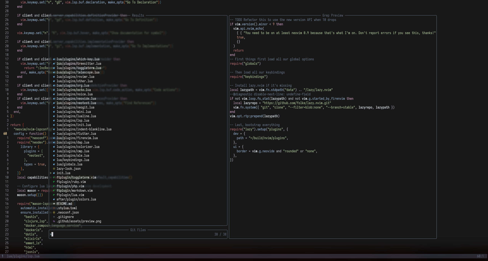

# Neovim dotfiles



Seems like this is just one refactor away from being good...

In any case, I'm pretty happy with how this has come together now so I can
finally add "some" docs.

Thanks to lazy.nvim making a more modular configuration possible, that'll be
the next step. Breaking up the massive table in init.lua into multiple files
and _then_ this will be documented.

## Usage

Clone to $XDG_CONFIG_HOME/nvim (usually ~/.config/nvim) and open nvim.

See `:checkhealth` for missing programs, I should probably add a few of my own
for this config, but it's pretty much just `git` and `rg`.

This also has setup for both Neovide and regular terminal; the former is where
most of my "project" work happens. I use an XDG desktop file like the below to
set this up:

```conf
[Desktop Entry]
Name=Neovide
GenericName=Text Editor
Comment=Edit text files
Exec=env XCURSOR_THEME="Norzdy-cursors" zsh -c "/home/linuxbrew/.linuxbrew/bin/neovide  %F"
Type=Application
Keywords=Text;editor;
Icon=/home/lkn/Pictures/icons/neovide.png
Categories=Utility;TextEditor;
StartupNotify=true
StartupWMClass=neovide
MimeType=text/english;text/plain;text/x-makefile;text/x-c++hdr;text/x-c++src;text/x-chdr;text/x-csrc;text/x-java;text/x-moc;text/x-pascal;text/x-tcl;text/x-tex;application/x-shellscript;text/x-c;text/x-c++;
```

The `XCURSOR_THEME` setup is needed to ensure that my cursor theme carries
over, then we launch via ZSH to ensure that `$PATH` and the like are configured
correctly.

As for terminal, that'd be [wezterm](https://wezfurlong.org/wezterm/). Hard to
beat it, does everything I need.
